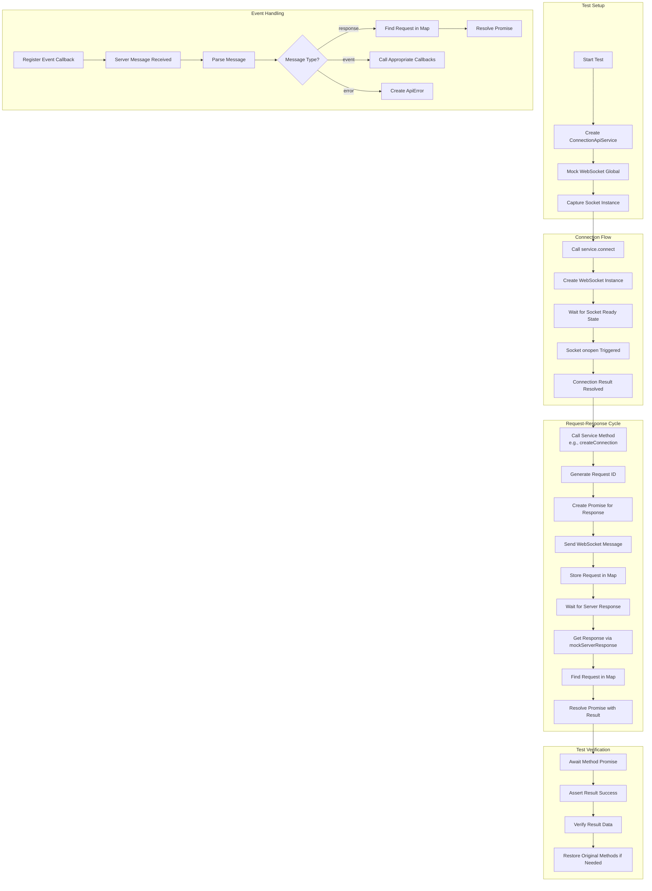

# WebSocket Testing Flow Diagram
{: .no_toc }

This diagram illustrates the flow of WebSocket communication in our test implementation, showing how the different components interact during test execution.

## Diagram

## Key Components

1. **Test Setup**: Creating the service and mocking WebSocket, capturing the actual socket instance.

2. **Connection Flow**: Establishing the WebSocket connection and handling the connection events.

3. **Request-Response Cycle**: Managing the request ID generation, promise creation, and message sending/receiving.

4. **Event Handling**: Processing different types of incoming WebSocket messages and triggering appropriate callbacks.

5. **Test Verification**: Asserting that operations completed successfully with the expected results.

## Implementation Notes

This flow diagram helped us identify key issues in our test implementation:

- Socket instance capturing was unreliable, causing spies to miss method calls
- Asynchronous timing required careful management to ensure operations completed
- Message tracking needed improvement for more reliable test verification
- Proper error handling and debugging were necessary throughout the flow

By visualizing this flow, we were able to address these issues systematically and create a more robust test implementation.